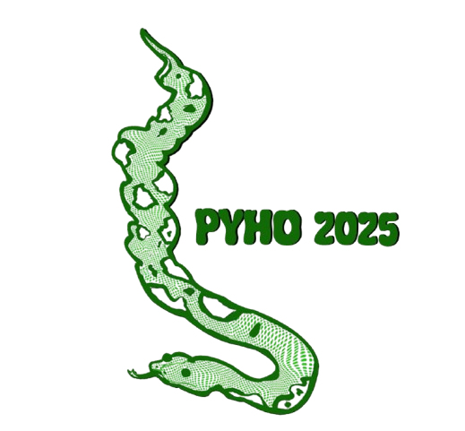
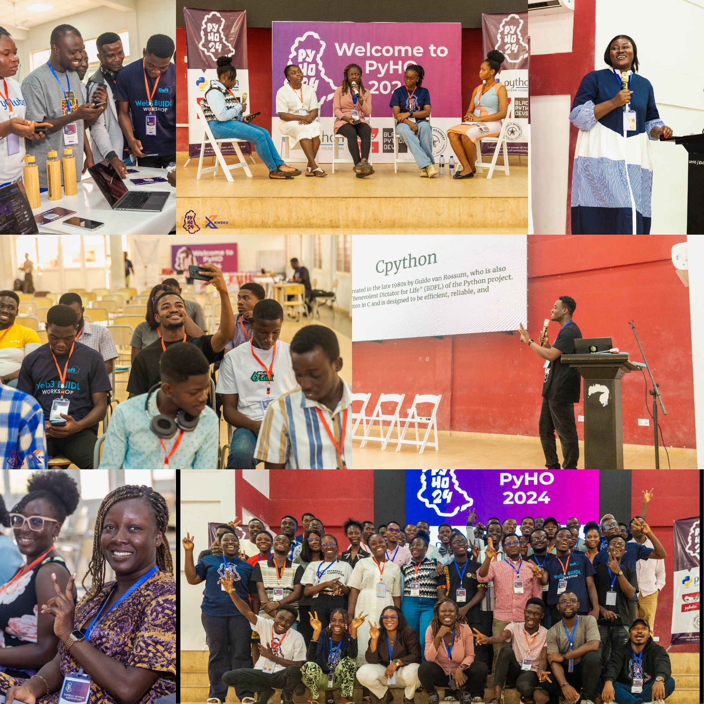
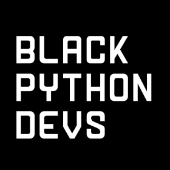

<title>PyHo 2025</title>

<header class="hero">
    
    
<b>October 24–25, 2025</b>

    

        A two-day developer and community conference for Pythonistas and tech enthusiasts  
    

    
G.R.N.M.A Hotel, Ho

    
    <!-- 

        <a href="https://www.papercall.io/cfps/6263/submissions/new" class="button cfp-button" target="_blank">📢 Submit a Talk Proposal</a>
        <a href="https://ti.to/pythonho/pyho-2025" class="button ticket-button" target="_blank">🎟️ Get Your Ticket</a>
    
 -->
</header>

<section class="about-pyho">
  <h1>Why PyHo?</h1>
  

    PyHo is more than just a Python conference — it’s where technology, innovation, and community meet in the heart of Ghana’s Oxygen City.  
      
    Designed for everyone from curious beginners to seasoned developers, PyHo celebrates learning, collaboration, and open-source culture. Whether you’re looking to dive deep into Python, connect with local and global experts, or explore the future of tech innovation, PyHo is your place to be.  
      
    Join us, learn something new, share your story, and build meaningful connections that last beyond the conference.
  

</section>

<section class="photo-section">
  <h1>2024 Highlight</h1>
  
</section>

<section class="sponsors">
  

    
    
    
    
    
    
  

</section>